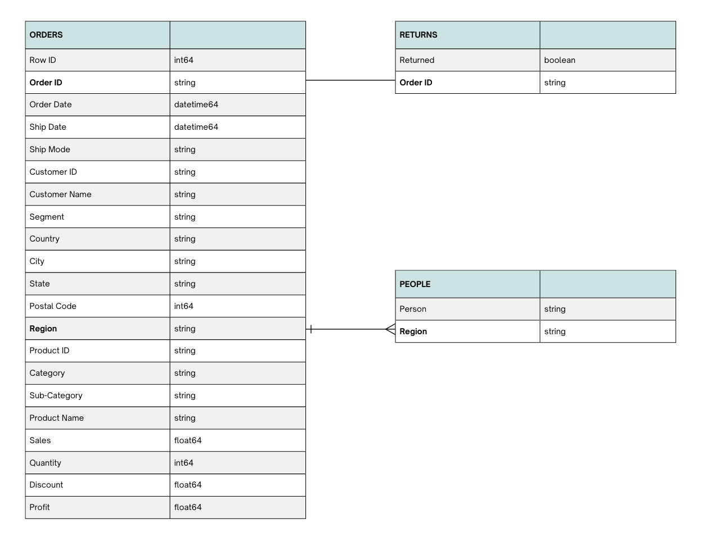

# Superstore Sales (2014-2017)

# Project Background 
Superstore, founded over a decade ago, is a fictional U.S.-based retail company specializing in a wide range of consumer and office products, available through its website and mobile app. The company has significant data on sales, operations, marketing, and customer behaviors. But much of this data has yet to be fully leveraged for strategic decision-making. This project undertakes a comprehensive analysis to unlock valuable insights that can enhance Superstore’s market position.

Insights and recommendations are provided on the following key areas:
- **Sales Trend Analysis:** Evaluation of sales patterns from 2014-2017. Identifying any major fluctuations in sales volumes by month, quarter, and year, as well as any notable seasonal patterns across different regions or product categories.
- **Growth Rates:** Identify where we are seeing the most significant growth and which areas might need more attention. I am aiming to understand our growth trajectory. Utilizing year-over-year growth rates in sales and profit by region, segment, and product category
- **Sales Performance Evaluation:**  An assessment of the performance of regional sales teams focusing on sales figures and profit margins by sales representatives or customer segments to identify any performance gaps.
- **KPI Reporting:** Tracking and analyzing essential Key Performance Indicators (KPIs) such as sales conversion rate, average order value, and customer lifetime value. 
- **Actionable Insights:** Identify any underperforming product categories or regions that. Also, understand which products are seeing a decline in sales or have low profitability.

The Python code used to inspect and clean the data for this analysis can be found here [link].
- Additionally, the cleaned version of the table can be found here [link].

The Python code used to explore sales trends can be found here [link].

An interactive Tableau dashboard used to present my findings can be found here [link].

# Data Structure & Initial Checks
Data can be downloaded [here](https://community.tableau.com/s/question/0D54T00000CWeX8SAL/sample-superstore-sales-excelxls)

The companies main database structure as seen below consists of four tables: Orders, Returns, People with a total row count of X records. A description of each table is as follows:
- **Orders:** represents individual transactions or orders placed by customers
- **Returns:** represents orders that have been returned, including information on which orders were returned
- **People:** represents salespeople or employees associated with different regions

    

# Executive Summary

### Overview of Findings

Explain the overarching findings, trends, and themes in 2-3 sentences here. This section should address the question: "If a stakeholder were to take away 3 main insights from your project, what are the most important things they should know?" You can put yourself in the shoes of a specific stakeholder - for example, a marketing manager or finance director - to think creatively about this section.

[Visualization, including a graph of overall trends or snapshot of a dashboard]

# Insights Deep Dive
### Category 1:

* **Main insight 1.** More detail about the supporting analysis about this insight, including time frames, quantitative values, and observations about trends.
  
* **Main insight 2.** More detail about the supporting analysis about this insight, including time frames, quantitative values, and observations about trends.
  
* **Main insight 3.** More detail about the supporting analysis about this insight, including time frames, quantitative values, and observations about trends.
  
* **Main insight 4.** More detail about the supporting analysis about this insight, including time frames, quantitative values, and observations about trends.

[Visualization specific to category 1]

### Category 2:

* **Main insight 1.** More detail about the supporting analysis about this insight, including time frames, quantitative values, and observations about trends.
  
* **Main insight 2.** More detail about the supporting analysis about this insight, including time frames, quantitative values, and observations about trends.
  
* **Main insight 3.** More detail about the supporting analysis about this insight, including time frames, quantitative values, and observations about trends.
  
* **Main insight 4.** More detail about the supporting analysis about this insight, including time frames, quantitative values, and observations about trends.

[Visualization specific to category 2]

### Category 3:

* **Main insight 1.** More detail about the supporting analysis about this insight, including time frames, quantitative values, and observations about trends.
  
* **Main insight 2.** More detail about the supporting analysis about this insight, including time frames, quantitative values, and observations about trends.
  
* **Main insight 3.** More detail about the supporting analysis about this insight, including time frames, quantitative values, and observations about trends.
  
* **Main insight 4.** More detail about the supporting analysis about this insight, including time frames, quantitative values, and observations about trends.

[Visualization specific to category 3]

### Category 4:

* **Main insight 1.** More detail about the supporting analysis about this insight, including time frames, quantitative values, and observations about trends.
  
* **Main insight 2.** More detail about the supporting analysis about this insight, including time frames, quantitative values, and observations about trends.
  
* **Main insight 3.** More detail about the supporting analysis about this insight, including time frames, quantitative values, and observations about trends.
  
* **Main insight 4.** More detail about the supporting analysis about this insight, including time frames, quantitative values, and observations about trends.

[Visualization specific to category 4]

# Recommendations:

Based on the insights and findings above, we would recommend the [stakeholder team] to consider the following: 

* Specific observation that is related to a recommended action. **Recommendation or general guidance based on this observation.**
  
* Specific observation that is related to a recommended action. **Recommendation or general guidance based on this observation.**
  
* Specific observation that is related to a recommended action. **Recommendation or general guidance based on this observation.**
  
* Specific observation that is related to a recommended action. **Recommendation or general guidance based on this observation.**
  
* Specific observation that is related to a recommended action. **Recommendation or general guidance based on this observation.**
  

# Assumptions and Caveats:

Throughout the analysis, multiple assumptions were made to manage challenges with the data. These assumptions and caveats are noted below:

* Assumption 1 (ex: missing country records were for customers based in the US, and were re-coded to be US citizens)
  
* Assumption 1 (ex: data for December 2021 was missing - this was imputed using a combination of historical trends and December 2020 data)
  
* Assumption 1 (ex: because 3% of the refund date column contained non-sensical dates, these were excluded from the analysis)
